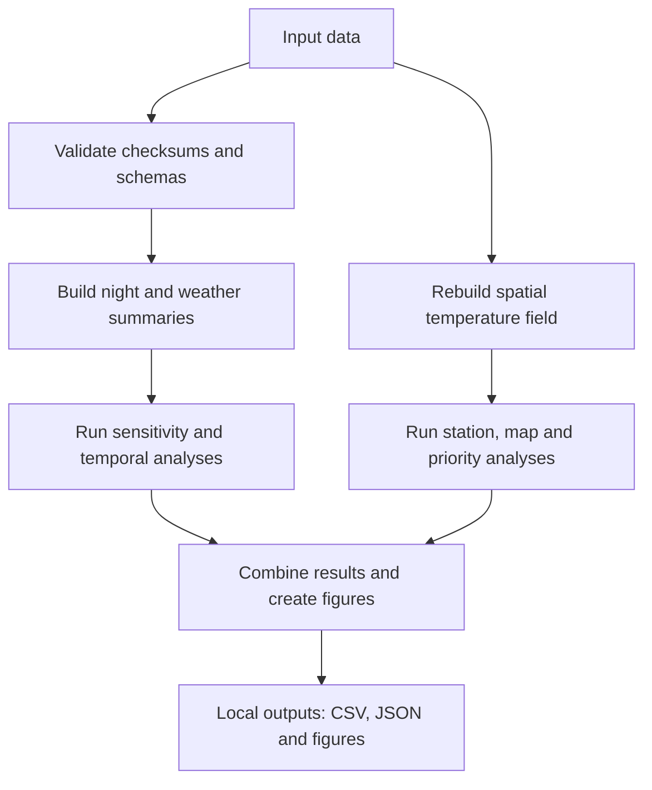

# Zurich urban heat analysis

This repository contains the input data and Python code for the study of
within-city temperature patterns in Zurich. 

## Run the analysis

Use Python 3.12. From this folder, create an environment, install the listed
packages, and run the pipeline:

```bash
python3.12 -m venv .venv
source .venv/bin/activate
python -m pip install -r requirements.txt
python pipeline/run_analysis.py
```

The scripts read the checked input files and write generated files to
`outputs_v3/`, `outputs_robust/`, `outputs_revision/` and `figures/`. Those
folders are ignored by Git. The initial temperature processing reads the full
archive and may need about 2.5 GB of memory. The complete analysis can take a
while because it includes bootstrap and spatial cross-validation calculations.

## Workflow



The runner executes the analysis scripts in dependency order. To rerun one
stage, call its script directly, for example `python pipeline/v3_01_night_metrics.py`.

## Repository contents

- `pipeline/` — analysis scripts and the ordered runner.
- `heat/`, `data_external/`, `data/inputs/`, `gis/` — input data and map layers.
- `requirements.txt` — pinned Python packages.
- `data_external/inputs_manifest.json` — SHA-256 checksums for the load-bearing
  inputs.

The 100 m screening grid in `data/inputs/` is a prepared input. Population,
building and other spatial layers come from City and Canton of Zurich and
swisstopo sources. Canopy height comes from Meta/WRI CHMv2; the FITNAH context
comes from the Canton of Zurich's 2024 status-quo model. Temperature fields
are rebuilt from the station data. Cold-air analyses exclude windows flagged
in `data_external/fitnah_coldflow_extraction_quality.csv`.

The raw temperature archive is City of Zurich open data. ERA5 responses and
their request details are documented in `data_external/era5_pinned/README.md`.

An additional spatial check fits the coverage adjustment inside each training
fold: `python pipeline/v3_29_fold_contained_validation.py` (after the main run).
Cooling-delay outputs include right-censoring fractions and Kaplan–Meier checks;
20 °C station medians cannot all be estimated during the available follow-up.
